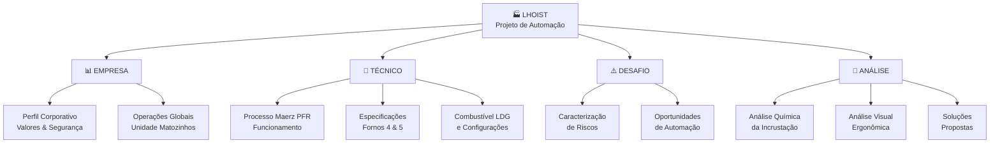
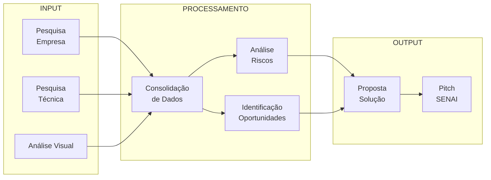

# 🏭 LHOIST MATOZINHOS - PESQUISA e DESAFIO DE AUTOMATIZAÇÃO

> **Projeto:** Automatização da limpeza de canais em fornos Maerz — Desafio SENAI 2026

---

## 📋 ÍNDICE DE DOCUMENTAÇÃO



---

## 📂 ESTRUTURA DE PASTAS

### 📌 **01_EMPRESA/**
Informações sobre a Lhoist como organização global e local.

- **perfil_corporativo.md** — História, valores, filosofia, inovação
- **politica_seguranca.md** — Política "Go for Zero", programa Stay Safe
- **unidade_matozinhos.md** — CNPJ, endereço, produtos, mercados

### 🔬 **02_TECNICO/**
Especificações detalhadas dos fornos e processos.

- **forno_maerz_pfr.md** — Funcionamento, esquemas, princípios técnicos
- **fornos_4_5_especificacoes.md** — Dados dos fornos da unidade
- **combustivel_ldg.md** — Características, composição, impacto no processo
- **parametros_operacionais.md** — Temperaturas, tempos, balanço de massa

### ⚠️ **03_DESAFIO/**
Análise do problema de limpeza e suas implicações.

- **caracterizacao_riscos.md** — Riscos ergonômicos, térmicos, químicos
- **oportunidades_automacao.md** — Requisitos, tecnologias de referência
- **impacto_financeiro.md** — Custos de parada, eficiência operacional

### 🧪 **04_ANALISE/**
Investigações profundas em química, ergonomia e soluções.

- **quimica_incrustacao.md** — Mecanismos de sinterização, causas raiz
- **analise_visual_ergonomica.md** — Análise de fotos, riscos detalhados
- **solucoes_propostas.md** — Gelo seco, ciclagem térmica, tratamento

### 📊 **05_SINTESE/**
Documentos consolidados para tomada de decisão.

- **resumo_executivo.md** — Visão 360° do projeto
- **matriz_comparativa.md** — Tabelas consolidadas de decisão
- **roadmap_implementacao.md** — Fases, cronograma, entregas

---

## 🎯 FLUXO DE INFORMAÇÃO



---

## 🔑 PONTOS-CHAVE

| Aspecto | Detalhe |
|---------|---------|
| **Empresa** | Lhoist Group — Maior produtora de cal do mundo (1889, Bélgica) |
| **Unidade** | Matozinhos, MG — 2 fornos Maerz PFR (Fornos 4 & 5) |
| **Produto** | Cal virgem (CaO) via calcinação de calcário |
| **Problema** | Incrustação de finos no canal de ligação entre cubas → limpeza perigosa e manual |
| **Frequência** | Forno 4: 2×/semana \| Forno 5: a cada 15 dias |
| **Risco Principal** | Exposição a 1.100°C + esforço físico extremo + espaço confinado (NR-33) |
| **Oportunidade** | Automatizar limpeza → segurança, eficiência, inovação de processo |

---

## 📖 GUIA DE LEITURA RÁPIDA

### ⚡ **Começo Rápido (15 min):**
→ Leia: `05_SINTESE/00_resumo_executivo.md`

### 🏢 **Para Entender a Empresa (30 min):**
1. `01_EMPRESA/01_perfil_corporativo.md`
2. `01_EMPRESA/02_politica_seguranca.md`
3. `01_EMPRESA/03_unidade_matozinhos.md`

### 🔬 **Para Entender o Processo Técnico (45 min):**
1. `02_TECNICO/01_forno_maerz_pfr.md`
2. `02_TECNICO/02_combustivel_ldg.md`

### ⚠️ **Para Entender o Desafio (30 min):**
1. `03_DESAFIO/01_caracterizacao_riscos.md`
2. `03_DESAFIO/02_oportunidades_automacao.md`

### 🧪 **Para Análise Profunda (45 min):**
1. `04_ANALISE/01_quimica_incrustacao.md`

### 🎯 **Pitch Executivo (5 min):**
→ `05_SINTESE/00_resumo_executivo.md` (contém todos os gráficos)

---

## 📂 LISTA COMPLETA DE ARQUIVOS

```
📦 02_LHOIST/
├── 📄 00_README.md (este arquivo)
│
├── 📁 01_EMPRESA/
│   ├── 01_perfil_corporativo.md
│   ├── 02_politica_seguranca.md
│   └── 03_unidade_matozinhos.md
│
├── 📁 02_TECNICO/
│   ├── 01_forno_maerz_pfr.md
│   └── 02_combustivel_ldg.md
│
├── 📁 03_DESAFIO/
│   ├── 01_caracterizacao_riscos.md
│   └── 02_oportunidades_automacao.md
│
├── 📁 04_ANALISE/
│   └── 01_quimica_incrustacao.md
│
└── 📁 05_SINTESE/
    └── 00_resumo_executivo.md
```

---

## 📊 CONTEÚDO POR ARQUIVO

| Arquivo | Tema | Público | Tempo |
|---------|------|---------|-------|
| `00_resumo_executivo.md` | Visão completa | Executivos, Designers | 10 min |
| `01_perfil_corporativo.md` | História, valores, inovação | Contexto geral | 10 min |
| `02_politica_seguranca.md` | "Go for Zero", NRs aplicáveis | Engenheiros, Segurança | 15 min |
| `03_unidade_matozinhos.md` | Dados CNPJ, capacidade, produção | Técnicos | 10 min |
| `01_forno_maerz_pfr.md` | Arquitetura, funcionamento, zonas | Engenheiros Processo | 20 min |
| `02_combustivel_ldg.md` | Composição, variações, impacto | Engenheiros Processo | 15 min |
| `01_caracterizacao_riscos.md` | NRs violadas, riscos detalhados | Segurança, Saúde | 15 min |
| `02_oportunidades_automacao.md` | Soluções, tecnologias, requisitos | Designers, Inovação | 20 min |
| `01_quimica_incrustacao.md` | Mecanismos, soluções químicas | Cientistas, P&D | 25 min |

---

## 🎯 PRÓXIMOS PASSOS

- [ ] Refinar pesquisa sobre **tecnologias de robótica para altas temperaturas**
- [ ] Contatar **Maerz** para especificações adicionais de design de acesso
- [ ] Modelar em **CAD:** geometria do poken in door vs. robô proposto
- [ ] Desenvolver **protótipo conceitual** ou simulação da limpeza
- [ ] Preparar **pitch visual** com mermaid e gráficos comparativos

---

## 💡 DICAS DE USO

✅ **Se está com tempo limitado:** Leia o resumo executivo (5 min) e pergunte para detalhe específico

✅ **Se precisa de credibilidade:** Mostre O README + Resumo executivo (demonstra organização)

✅ **Se precisa de detalhes técnicos:** Entre direto na pasta temática (ex: 02_TECNICO/)

✅ **Se faz pitch:** Use os gráficos Mermaid do resumo executivo (visual > texto)

---

_Última atualização: 14/04/2026 | Projeto SENAI 2026 — Automatização Lhoist Matozinhos_

**Status: ✅ Documentação reorganizada e consolidada | Pronto para proposta de solução**
