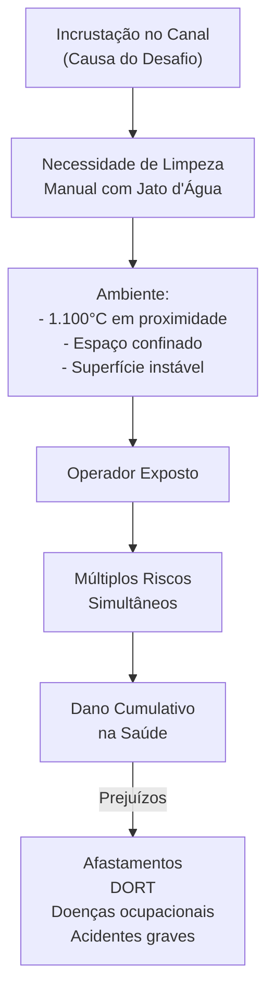

# ⚠️ CARACTERIZAÇÃO DO DESAFIO - RISCOS E SOBRECARGA

> **Diagnóstico:** Limpeza manual de canais em fornos Maerz é uma tarefa classificada como **risco crítico** em normas internacionais de espaços confinados e trabalho a quente.

---

## 📊 RISCOS POR CATEGORIA

### 🔴 RISCOS ERGONÔMICOS (NR-17 / DORT)

| Risco | Descrição | Classificação |
|-------|-----------|---|
| **Flexão de tronco** | >45° sustentada durante toda operação | Crítico |
| **Flexão cervical** | Acentuada, repetitiva (olhando para canal) | Crítico |
| **Força bilateral** | Lança pressurizada manejada com ambas mãos | Crítico |
| **Abertura de tampa** | Marreta 5kg com impacto repetitivo | Grave |
| **Levantamento** | Tampa ~20kg deslocada após abertura | Grave |
| **Isometria** | Contração contínua para manutenção postural | Grave |

**Resultado:** Acúmulo de dano musculoesquelético crônico → LER/DORT

---

### 🟠 RISCOS TÉRMICOS (NR-15 / INMETRO)

| Risco | Descrição | Dados |
|-------|-----------|-------|
| **Radiação direta** | Rosto expostos a material a 1.100°C | Distância ~10-15 cm |
| **Carga térmica de EPI** | Macacão JGB retém calor corporal | Agrava estresse térmico |
| **Turno limitado** | Operador restrito a 15-20 min de trabalho | Requer revezamento |
| **Equipes necessárias** | Para manter limpeza contínua | 3 operadores por turno |

**Resultado:** Estresse térmico extremo → Dermatite, desidratação, síncope

---

### 🟡 RISCOS QUÍMICOS (NR-9 / INMETRO)

| Risco | Descrição | Exposição |
|-------|-----------|-----------|
| **Cal viva (CaO)** | Altamente alcalina, irritante | Inalação + contato dérmico |
| **CO₂** | Emanação do processo | Risco de hipocapnia em espaço confinado |
| **CO** | Possível em combustão incompleta | Risco de hipóxia |
| **Névoa de cal** | Partículas finas dispersas | Respiratória |

**Resultado:** Lesão de VAS, irritação ocular, danos respiratórios crônicos

---

### 🔵 RISCOS DE ACIDENTE (NR-18 / NR-35 / NR-33)

| Risco | Descrição | Potencial |
|-------|-----------|-----------|
| **Trabalho em altura** | Acesso via escada em plataforma | Queda |
| **Superfícies escorregadias** | Pó de cal no piso | Queda |
| **Mangueira sob pressão** | 3,5 bar entre pernas do operador | Explosão repentina |
| **Ejeção de material** | Material incandescente pelo jato | Queimadura grave |
| **Liberação súbita de gases** | Forno em pressão diferencial | Choque térmico |
| **Espaço confinado** | Sem saída rápida em emergência | Impossibilidade de resgate ágil |

**Resultado:** Potencial de acidente grave ou fatal

---

## 📸 EVIDÊNCIAS VISUAIS

### Imagem Crítica: Brasa Visível

O operador trabalha com **rosto a centímetros de material incandescente a 1.100°C**.

**Interpretação:** Não aceitável em análise moderna de risco.

### Imagem: Operador Completamente Coberto de Cal

Pó branco impregnado em roupa, capacete, rosto.

**Interpretação:** Exposição dérmica/respiratória significativa durante toda operação.

---

## 🔑 NORMAS REGULATÓRIAS APLICÁVEIS

| Norma | Tema | Violação em Limpeza |
|-------|------|---|
| **NR-15** | Atividades penosas (calor, radiação) | Exposição a 1.100°C prolongada |
| **NR-17** | Ergonomia e prevenção LER/DORT | Flexão sustentada, força bilateral |
| **NR-33** | Espaços confinados | Acesso limitado, atmosfera IDLH potencial |
| **NR-35** | Trabalho em altura | Acesso via escada em plataforma |
| **NR-18** | Condições de trabalho | Superfícies inadequadas |

---

## 💼 FREQUÊNCIA DE EXPOSIÇÃO

| Forno | Frequência | Anual | Impacto |
|-------|-----------|-------|--------|
| **Forno 4** | 2× por semana | ~104 limpezas/ano | Exposição muito frequente |
| **Forno 5** | A cada 15 dias | ~24 limpezas/ano | Exposição moderada |

**Interpretação:** Forno 4 é crítico — operador exposto semanalmente

---

## 📋 EQUIPAMENTO ATUAL

| Item | Especificação | Observação |
|-----|-------------|-----------|
| Lança | Metálica ½\" | Manual |
| Mangueira | ½\" | Sob pressão 3,5 bar |
| Pressão jato | ~3,5 bar | Força de reação considerável |
| Tampa | ~20 kg | Sistema cunha, difícil abertura |
| Ferramenta | Marreta ~5 kg | Impacto repetitivo |
| EPIs | Macacão JGB + Korion + botas | Proteção, mas aumenta carga térmica |

---

## 🎯 CONCLUSÃO DIAGNÓSTICA

---

> **Próximo:** Consulte `../03_DESAFIO/oportunidades_automacao.md` para solução sistêmica
