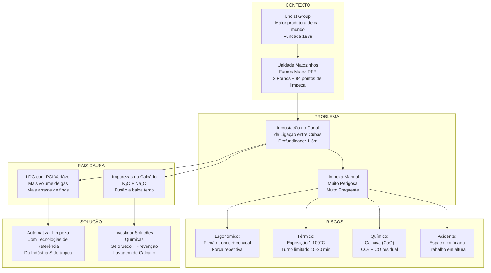

# 📊 RESUMO EXECUTIVO — PROJETO AUTOMATIZAÇÃO LHOIST

---

## 🎯 VISÃO 360°



---

## 📋 DADOS CONSOLIDADOS

### 🏢 EMPRESA

| Métrica | Valor |
|---------|-------|
| Fundação | 1889 (Bélgica) |
| Presença Global | +120 fábricas em +25 países |
| Funcionários | 6.400+ |
| Patentes | ~490 concedidas; +450 em análise |
| **Foco Inovação** | Oxi-combustão, produtos especiais, eficiência |
| **Gargalo** | Pouca patente em automação de *processos* (manutenção/limpeza) |

### 🏭 UNIDADE MATOZINHOS

| Métrica | Valor |
|---------|-------|
| CNPJ | 06.730.693/0004-05 |
| Localização | MG 424 km 53, Matozinhos-MG |
| Capacidade | Parte da produção 2,5 Mt/ano Brasil |
| Fornos | 2 (Maerz PFR – Furnos 4 & 5) |
| Pontos Acesso | 36 + 48 = 84 poken in doors |
| Combustível | LDG (subproduto aciarias próximas) |
| Investimento Recente | R$ 470M em MG (últimos 5 anos); R$ 75M nova planta moagem |

### 🔥 FORNO MAERZ PFR

| Parâmetro | Valor |
|-----------|-------|
| Tipo | Dupla cuba regenerativa, fluxo paralelo |
| Eficiência Térmica | Até 85% (maior do mercado) |
| Consumo Específico | ~850 kcal/kg de cal |
| Temperatura Calcinação | ~1.100°C (ótimo); 850°C–1.200°C (operacional) |
| Ciclo Inversão | 12–15 minutos alternância de cubas |
| Lanças | 33 por cuba (66 total) — injeção LDG |

### ⚠️ DESAFIO

| Aspecto | Forno 4 | Forno 5 |
|--------|--------|--------|
| Poken In Doors | 36 (18/cuba) | 48 (24/cuba) |
| Frequência Limpeza | 2×/semana | a cada 15 dias |
| Riscos | Ergonômico crítico | Ergonômico grave |
| Exposição Anual | ~104 limpezas/ano | ~24 limpezas/ano |

---

## 🚨 RISCOS CRÍTICOS

### Por NR

| NR | Tema | Classificação |
|---|---|---|
| **NR-15** | Calor + Radiação (1.100°C) | 🔴 Crítico |
| **NR-17** | Ergonomia (flexão + força) | 🔴 Crítico |
| **NR-33** | Espaço Confinado | 🔴 Crítico |
| **NR-35** | Trabalho em Altura | 🟠 Grave |
| **NR-18** | Condições Trabalho | 🟠 Grave |

### Consequências Saúde

- **LER/DORT:** Acúmulo cronico (flexão + força + isometria)
- **Doenças Respiratórias:** Cal viva (CaO) é altamente alcalina, irritante
- **Estresse Térmico:** Turno de apenas 15-20 min → Necessidade de 3 operadores
- **Acidentes Graves:** Potencial de queimadura, queda, liberação súbita de gases

---

## 💡 OPORTUNIDADES PRIORITÁRIAS

### Prioridade 1: Abertura Automatizada de Tampa
- **Tecnologia:** Atuador pneumático
- **Impacto:** Remove marreta 5kg; reduz flexão inicial
- **Complexidade:** Baixa
- **ROI:** Rápido

### Prioridade 2: Lança Telescópica Automatizada
- **Tecnologia:** Lança robusta + PLC + câmera térmica
- **Impacto:** Remove exposição ao calor; operador em remoto
- **Complexidade:** Média
- **ROI:** Médio-longo

### Prioridade 3: Monitoramento Preditivo
- **Tecnologia:** Sensores + algoritmo + integração supervisório
- **Impacto:** Reduz frequência de limpeza; otimiza operação
- **Complexidade:** Alta
- **ROI:** Longo prazo (benefício contínuo)

---

## 🧪 ANÁLISE QUÍMICA

### Causa Raiz da Incrustação

```
K₂O / Na₂O em calcário (~0,5%)
    ↓
Forma fase líquida a 700–800°C (eutético muito baixo)
    ↓
Silicatos fundidos (CaO–SiO₂–Fe₂O₃)
    ↓
Aderência ao refratário + Sinterização
    ↓
Crosta dura, ligação química (não é "sujeira")
```

### Soluções Complementares

| Solução | Prazo | Viabilidade | Impacto |
|---------|-------|-----------|--------|
| **Gelo Seco** | Curto (6-12 meses) | Alta | +90% remoção crosta |
| **Ciclagem Térmica** | Médio (1-2 anos) | Média | Reduz frequência |
| **Lavagem Calcário** | Longo (2+ anos) | Baixa (complexo) | Previne formação |
| **Revestimento ZrO₂** | Médio (1 ano) | Alta | Anti-aderência |

---

## 💰 FINANCEIRO (BENCHMARKS)

### Custos de Parada (Downtime)

| Cenário | Custo Estimado |
|---------|---|
| Um forno parado | US$ 50K–200K por dia |
| Resfriamento pré-limpeza | 24–48 horas (~US$ 100K–400K) |
| Forno quente (máq. >200°C) | 2–4 horas (~US$ 4K–16K) |

### Retorno Estimado (Automação)

**Se automação reduz resfriamento em 24h:**
- ROI por limpeza: Recupera ~US$ 50K–100K em produção
- Forno 4 (2×/semana): ~US$ 5M–10M/ano potencial

---

## 🎓 BENCHMARKS

- **Fornos Siderúrgicos (EUA/Europa):** 80% com automação
- **Fornos Cimento (China):** 30% adotando robótica (últimos 5 anos)
- **Fornos Cal (Brasil):** <5% automatizados (OPPORTUNITY)

---

## 📅 ROADMAP (SUGESTÃO)

| Fase | O quê | Quando |
|------|-------|--------|
| **1 — Pesquisa** | Consolidar specs; investigar fornecedores robótica | 3 meses |
| **2 — Prototipagem** | MVP: sistema de abertura de tampa | 6 meses |
| **3 — Piloto** | Testar em Forno 5 (menos frequência) | 6 meses |
| **4 — Escala** | Expandir para Forno 4 + outras Lhoist | 12 meses |
| **5 — Otimização** | Integração supervisório + gelo seco + prevenção | Contínuo |

---

## ✅ CONCLUSÕES

1. **Problema real:** Limpeza manual é risco crítico por três normas (NR-15, 17, 33)
2. **Causa identificada:** Incrustação de álcalis + LDG variável → necessidade frequente
3. **Solução viável:** Tecnologias consolidadas existem (robotização, gelo seco, sensores)
4. **Oportunidade:** Ser *pioneer* em Brasil; patenteável; alinha com "Go for Zero" da Lhoist
5. **Impacto:** Segurança + Eficiência + Inovação + ROI financeiro positivo

---

## 📚 PRINCIPAIS DOCUMENTOS

- `01_EMPRESA/perfil_corporativo.md` — Quem é Lhoist
- `01_EMPRESA/politica_seguranca.md` — Compromisso "Go for Zero"
- `02_TECNICO/forno_maerz_pfr.md` — Como funciona
- `02_TECNICO/combustivel_ldg.md` — Por que a incrustação ocorre
- `03_DESAFIO/caracterizacao_riscos.md` — Risco detalhado
- `03_DESAFIO/oportunidades_automacao.md` — Soluções tecnológicas
- `04_ANALISE/quimica_incrustacao.md` — Química da crosta

---

_Projeto SENAI 2026 — Automatização Lhoist Matozinhos | 14/04/2026_
