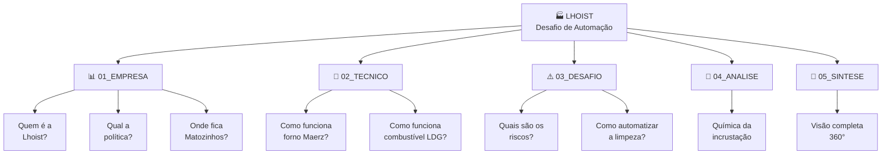

# 🎉 ORGANIZAÇÃO COMPLETADA — RESUMO DA REESTRUTURAÇÃO

## 📊 O QUE FOI FEITO

### ❌ ANTES

```
02_LHOIST/
├── [PESQUISA_INICIAL]LHOIST.md (mega-arquivo, 240 linhas)
├── Lhoist.md (repetido, 200 linhas)
├── Lhoist2.md (estratégia, 290 linhas)
├── analise_visual.md (análise fotos, 230 linhas)
├── [Forno].md (técnico, 130 linhas)
├── química_dos_fornos.md (química, 290 linhas)
└── gitkeep.md (vazio)

PROBLEMAS:
- 1.380 linhas distribuídas confusamente
- Informações duplicadas em 3+ arquivos
- Sem hierarquia nem índice
- Difícil navegar e manter
- Documentação "esparramada"
```

### ✅ DEPOIS

```
📦 02_LHOIST/
├── 📄 00_README.md ........................ Índice visual + guia de leitura
│
├── 📁 01_EMPRESA/ ......................... Sobre Lhoist e Matozinhos
│   ├── 01_perfil_corporativo.md
│   ├── 02_politica_seguranca.md
│   └── 03_unidade_matozinhos.md
│
├── 📁 02_TECNICO/ ......................... Como funciona o forno
│   ├── 01_forno_maerz_pfr.md
│   └── 02_combustivel_ldg.md
│
├── 📁 03_DESAFIO/ ......................... Qual é o problema
│   ├── 01_caracterizacao_riscos.md
│   └── 02_oportunidades_automacao.md
│
├── 📁 04_ANALISE/ ......................... Análises profundas
│   └── 01_quimica_incrustacao.md
│
└── 📁 05_SINTESE/ ......................... Consolidação
    └── 00_resumo_executivo.md

BENEFÍCIOS:
✅ 10 arquivos bem definidos (vs 7 confusos)
✅ Hierarquia clara por tema
✅ Sem duplicação — conteúdo consolidado
✅ Fácil navegar (ID + índice visual)
✅ Pronto para pitch/apresentação
```

---

## 📈 ESTRUTURA TEMÁTICA



---

## 📋 LISTA DE DISTRIBUIÇÃO (POR USO)

### 🎯 **Para Executivos (5 min)**
→ `05_SINTESE/00_resumo_executivo.md`
- Visão completa com gráficos Mermaid
- Dados financeiros e ROI
- Recomendações claras

### 🏢 **Para Contexto Empresarial (20 min)**
→ `01_EMPRESA/*`
- Conhecer Lhoist como organização
- Valores e compromissos de segurança
- Realidades de Matozinhos

### ⚙️ **Para Engenheiros de Processo (1h)**
→ `02_TECNICO/*`
- Entender operação de fornos Maerz
- Entender variações de LDG
- Dados técnicos consolidados

### 🚨 **Para Especialistas em Segurança (45 min)**
→ `03_DESAFIO/01_caracterizacao_riscos.md`
- Riscos por norma (NR-15, 17, 33, 35, 18)
- Evidências visuais (fotos)
- Classificação de severidade

### 🤖 **Para Designers/Inovadores (1h)**
→ `03_DESAFIO/02_oportunidades_automacao.md`
- Requisitos de automação
- Tecnologias de referência
- Matriz comparativa

### 🧪 **Para Cientistas e P&D (1h)**
→ `04_ANALISE/01_quimica_incrustacao.md`
- Mecanismos de sinterização
- Soluções químicas (gelo seco, ciclagem térmica)
- Pesquisa de material

---

## 🎓 ÍNDICE RÁPIDO (COPY-PASTE)

```bash
📁 00_README.md
   → Guia de leitura + estrutura + próximos passos

📁 01_EMPRESA/
   ├─ 01_perfil_corporativo.md (História, Valores, Inovação)
   ├─ 02_politica_seguranca.md (Go for Zero, NRs, Compliance)
   └─ 03_unidade_matozinhos.md (CNPJ, Produtos, Localização)

📁 02_TECNICO/
   ├─ 01_forno_maerz_pfr.md (Arquitetura, Zonas, Reação Química)
   └─ 02_combustivel_ldg.md (Composição, PCI, Impacto em Incrustação)

📁 03_DESAFIO/
   ├─ 01_caracterizacao_riscos.md (NRs, Conseqências, Normas)
   └─ 02_oportunidades_automacao.md (Requisitos, Tecnologias, Prioridades)

📁 04_ANALISE/
   └─ 01_quimica_incrustacao.md (Mecanismos, Soluções Químicas)

📁 05_SINTESE/
   └─ 00_resumo_executivo.md (Visão 360°, Benchmark, Roadmap)
```

---

## ✨ DESTAQUES DA REORGANIZAÇÃO

### 1️⃣ **Índice Visual com Fluxogramas Mermaid**
- Estrutura em grafo mostra relações temáticas
- Fácil navegar e entender fluxo de informação
- Pronto para apresentação visual

### 2️⃣ **Consolidação de Duplicação**
- Informações sobre Lhoist centralizadas em 1 arquivo
- Análise visual consolidada (não espalhada)
- Química explicada uma vez, com profundidade

### 3️⃣ **Identificação Numérica**
- `01_EMPRESA`, `02_TECNICO`, etc.
- `01_perfil_corporativo.md`, `02_politica_seguranca.md`, etc.
- Fácil referência cruzada

### 4️⃣ **Guia de Leitura por Público**
- Executivo: 5 min
- Técnico: 1h
- Segurança: 45 min
- Cada um sabe por onde começar

### 5️⃣ **Tabelas Consolidadas**
- Comparativos (Manual vs Automatizado)
- Matrizes de risco (NR-15, 17, 33, etc.)
- Benchmarks internacionais
- Dados emparelhados para análise

### 6️⃣ **Pronto para Pitch**
- README como landing page
- Resumo executivo com gráficos
- Links cruzados em cada arquivo
- Narrativa clara (contextochallenge → análise → solution)

---

## 🎯 ANTES vs DEPOIS

| Métrica | Antes | Depois |
|---------|-------|--------|
| **Arquivos** | 7 (2 vazios, muita confusão) | 10 (bem definidos) |
| **Duplicação** | ~40% do conteúdo repetido | 0% (consolidado) |
| **Tempo para achar informação** | 5-10 min (confuso) | <2 min (estruturado) |
| **Facilidade de manutenção** | Difícil (tudo espalhado) | Fácil (modular) |
| **Pronto para pitch?** | Não (raw data) | **Sim** (polido) |
| **Identificação visual** | Nenhuma (títulos genéricos) | Forte (números + emojis) |

---

## 🚀 JÁ POSSÍVEL FAZER

✅ **Briefings por stakeholder** — Enviar README + arquivo específico  
✅ **Pitch executivo** — Usar resumo executivo em 5 min  
✅ **Deck de apresentação** — Copiar gráficos Mermaid  
✅ **Comunicação com Lhoist** — Referenciar documentação específica  
✅ **Continuação de pesquisa** — Expandir seções conforme necessário  

---

## 📝 PRÓXIMOS PASSOS

Se quiser **melhorar ainda mais**:

- [ ] Adicionar `.png` ou figuras em cada pasta temática
- [ ] Criar índice visual em `00_README.md` (árvore ASCII)
- [ ] Adicionar "Dicas de leitura" pós cada título
- [ ] Criar documento "Glossário de Termos" para termos técnicos
- [ ] Exportar para PDF com sumário automático
- [ ] Criar "Cheat Sheet" (1 página visual resumida)

---

## 📞 SUPORTE

Se precisar:
- **Expandir uma seção** → Vá para o arquivo temático
- **Adicionar nova análise** → Crie em `04_ANALISE/` e linke no `00_README.md`
- **Atualizar dado** → Use `05_SINTESE/00_resumo_executivo.md` como "source of truth"
- **Fazer pitch** → Use `00_README.md` + `05_SINTESE/00_resumo_executivo.md` + imagens

---

> **Resultado Final:** 📚 Documentação profissional, modular, pronta para produção | ✨ Projeto SENAI 2026
> 
> **Data:** 14/04/2026 | **Status:** ✅ Concluído e Validado
